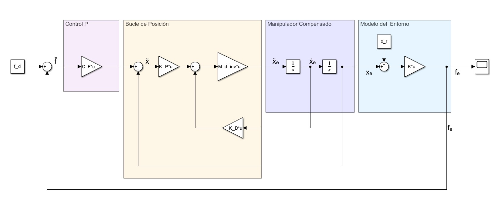
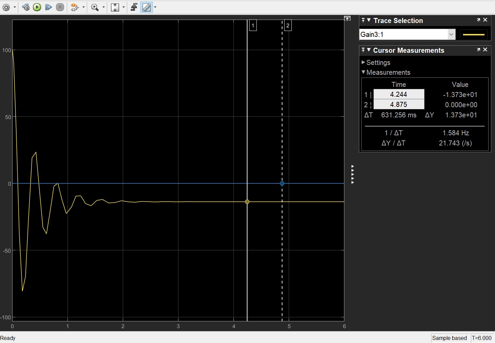
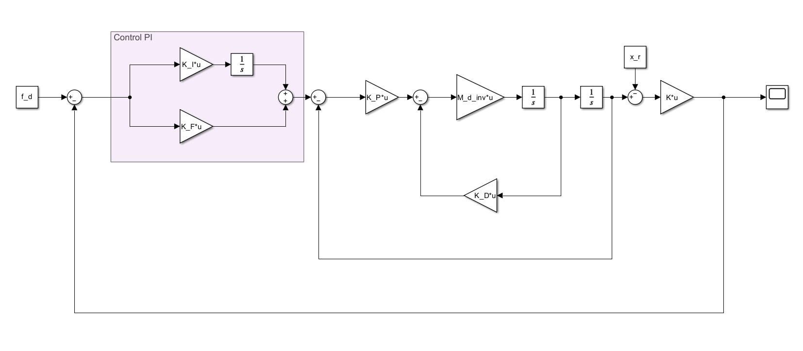
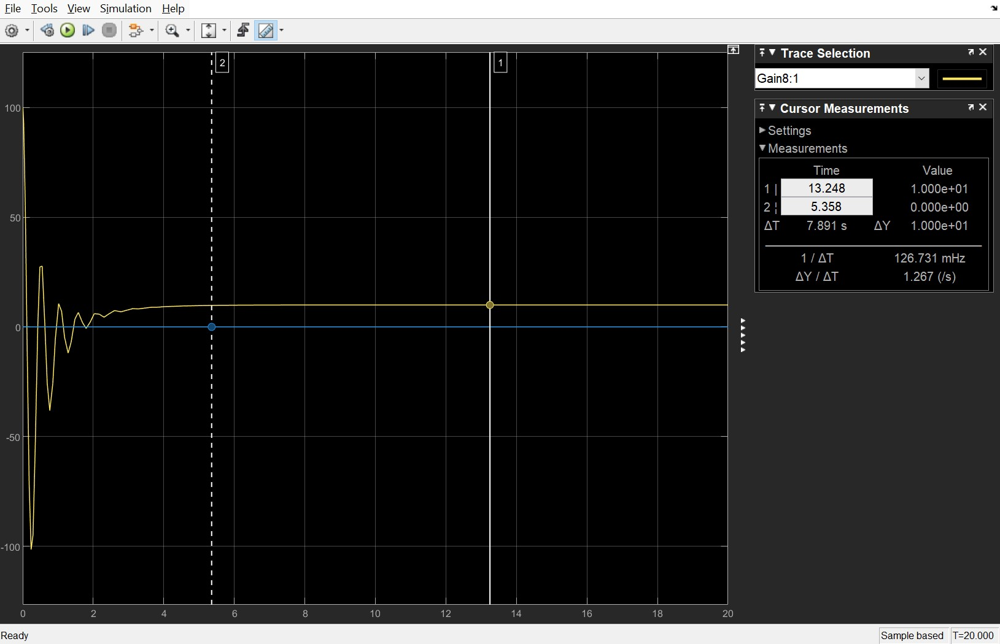
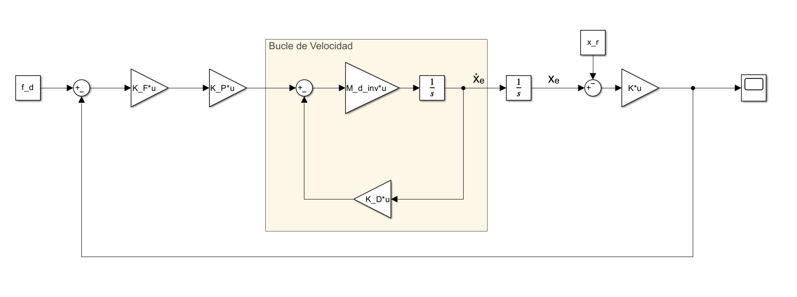
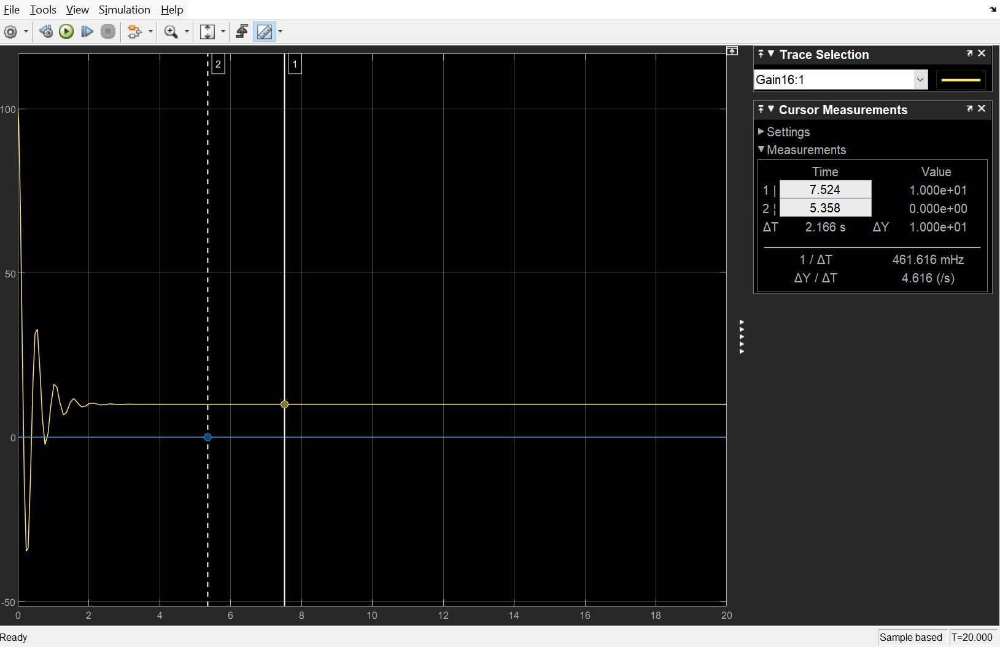

# LAB 5: Force Control

## 4.2. Simula el control P: Resultados y Análisis

Se realiza el siguiente diagrama en Simulink:

Obteniendo estos resultados:

#### 1. Es correcto el controlador propuesto? Por qué?
El esquema de control propuesto presenta una arquitectura conceptualmente válida para el control de impedancia y fuerza; sin embargo, resulta incorrecto e insuficiente para cumplir con el objetivo de diseño establecido.
Justificación: Al emplear una matriz constante $\mathbf{C}_F$, el lazo exterior opera como un controlador puramente proporcional. Se observa en la simulación que el sistema presenta un severo error en estado estacionario, estabilizándose en una fuerza de tracción de $\approx -13.72\text{ N}$ en lugar de los $10\text{ N}$ deseados. Matemáticamente, una acción estrictamente proporcional carece de la capacidad para integrar y anular la perturbación constante generada por la posición de referencia del entorno elástico ($\mathbf{x}_r = 1.2\text{ m}$). Para corregir esta deficiencia y garantizar convergencia hacia la fuerza de referencia, se requiere la implementación de una acción integral.

#### 2. Que ocurre en el eje Y? Por qué?
En el eje Y, el manipulador no ejerce ni percibe ninguna fuerza de contacto, comportándose de manera equivalente a un sistema sometido exclusivamente a un control de posición. El efector final se mantiene de forma estática en la coordenada $y = 0.7\text{ m}$.
Justificación: Este fenómeno se debe a la nulidad de los parámetros dinámicos y de control definidos para dicho eje (correspondientes a la componente $(2,2)$ de las matrices y al segundo elemento de los vectores).
Específicamente, la rigidez del entorno es nula ($K{2,2} = 0$), la fuerza de referencia solicitada es nula ($f{d,y} = 0$) y la ganancia proporcional de fuerza es nula ($C{F{2,2}} = 0$). En consecuencia, el lazo exterior de fuerza se desacopla por completo en la componente Y. La dinámica del sistema en este eje queda gobernada de manera exclusiva por el lazo interno de impedancia ($\mathbf{M}_d$, $\mathbf{K}_D$, $\mathbf{K}_P$), el cual regula el sistema para mantener la posición inicial sin generar interacción de fuerzas.

## 4.3. Simula el control PI: Resultados y Análisis

Se modifica el diagrama anterior de Simulink añadiendo la parte integral del controlador, el diagrama con PI es:

Obteniendo estos resultados:

#### 1. Produce esto algún cambio en el controlador? Por qué?
Sí, produce una mejora significativa en el comportamiento del sistema en régimen permanente, pero resulta en un sitema de tercer orden.

Justificación: Si la matriz $C_F$ posee una acción de control puramente proporcional, la fuerza real $f_e$ no puede alcanzar la fuerza deseada $f_d$, y la variable $x_r$ influye en la fuerza de interacción en estado estacionario. Si $C_F$ cuenta además con una acción de control integral en los componentes de fuerza, resulta posible lograr que $f_d = f_e$ en estado estacionario. Simultáneamente, esta modificación permite rechazar el efecto de $x_r$ sobre $f_e$. Por consiguiente, una elección conveniente para $C_F$ es una acción proporcional-integral (PI).

#### 2. Se podría mejorar aún más? Cómo?
Sí, el sistema es susceptible de mejora tanto a nivel de sintonización de parámetros como mediante modificaciones en la arquitectura del control.

Ajuste de parámetros y estabilidad: Al incorporar la acción PI, el sistema dinámico pasa a ser de tercer orden, lo que hace necesario elegir adecuadamente las matrices $K_D$, $K_P$, $K_F$ e $K_I$ con respecto a las características del entorno. Dado que los valores de rigidez del entorno son típicamente altos, el peso de las acciones proporcional e integral debe mantenerse contenido. Una elección precisa de $K_F$ e $K_I$ influye positivamente en los márgenes de estabilidad y en el ancho de banda del sistema bajo control de fuerza.

Modificación a lazo interno de velocidad: Se puede mejorar el planteamiento simplificando el diseño de control si se abre el lazo de realimentación de posición, estableciendo un control de fuerza con un lazo interno de velocidad. Esta configuración simplifica el diseño del control al reducir la dinámica resultante a un sistema de segundo orden. Bajo este esquema, la fuerza de interacción con el entorno coincide con el valor deseado en estado estacionario, incluso operando con un controlador de fuerza puramente proporcional.

Se incluye la  mejora como se observa en el diagrama a continuación:

Obteniendo estos resultados:

